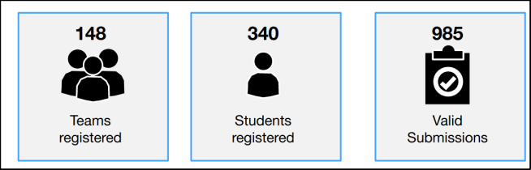

# Versed Chimpanzee — The Winner of TUM Analytics Cup 2022 

Our team (Versed Chimpanzee)  came **_first_** among 340 people and 148 registered teams (119 teams did submission) in TUM Analytics Cup 2022 challenge sponsored by [Siemens Advanta Consulting](https://www.siemens-advanta.com/) and organized by [TUM Informatics Decision Sciences & Systems Department](https://www.in.tum.de/en/dss). Participant Statistics can be seen below:




## About TUM Analytics Cup 2022

In Analytics Cup 2022 challenge, teams developed a predictive model that classifies offers into successful and unsuccessful ones using multiple real-world data sets provided by Siemens Advanta Consulting and one of their clients. The given dataset contains offers for existing customers at facilities where Siemens' client company has already deployed some smart infrastructure products, but also offers to entirely new facilities without a previously existing business relationship. The products comprise the categories fire, security, and comfort. Our model lays the foundation for developing decision-support tools for the sales departments of Siemens' client. For more information on TUM Analytics Cup 2022, please check the following documents:
* [Introduction_to_AC_Presentation.pdf](./docs/Introduction_to_AC_Presentation.pdf)
* [Analytics_Cup_2022_Challenge_Info.pdf](./docs/Analytics_Cup_2022_Challenge_Info.pdf)


## Versed Chimpanzee Group Members


| Contributer    | GitHub Account                                         | LinkedIn Account                                                                             | Email Address                                                 | Other Links                                            |
|----------------|--------------------------------------------------------|----------------------------------------------------------------------------------------------|---------------------------------------------------------------|--------------------------------------------------------|
| Berk Sudan     | [github.com/berksudan](https://github.com/berksudan)   | [linkedin.com/in/berksudan](https://linkedin.com/in/berksudan)                               | [berk.sudan@protonmail.com](mailto:berk.sudan@protonmail.com) | [medium.com/@berksudan](https://medium.com/@berksudan) |
| Teofil Bodea   | [github.com/Teofil98](https://github.com/Teofil98)     | [linkedin.com/in/teofil-bodea-4090811a3](https://linkedin.com/in/teofil-bodea-4090811a3)     | [teo.bodea12@yahoo.com](mailto:teo.bodea12@yahoo.com)         | -                                                      |
| Li Zhou        | [github.com/lizhouinfo](https://github.com/lizhouinfo) | [linkedin.com/in/li-zhou-782021226](https://linkedin.com/in/li-zhou-782021226)               | [li.zhou@tum.de](mailto:li.zhou@tum.de)                       | -                                                      |
| Saqib Ali Khan | [github.com/saqib22](https://github.com/saqib22)       | [linkedin.com/in/saqib-ali-khan-660913129](https://linkedin.com/in/saqib-ali-khan-660913129) | [asaqibkhans@outlook.com](mailto:asaqibkhans@outlook.com)     | -                                                      |


## How to Build

+ If you are using a GNU/Linux operating system, you can directly build by executing the following Bash command:

```bash
chmod u+x ./build.sh && ./build.sh
```

+ If you are not using a GNU/Linux operating system, please manually install dependencies in ``requirements.txt`` and make sure that your python and pip packages are up-to-date. 


## How to Run

+ If you are using a GNU/Linux operating system, start Jupyter Notebook by executing the following Bash command:

```bash
chmod u+x ./run.sh && ./run.sh
```

+ Then, you can open the notebooks in ``notebooks`` directory.

+ If you are not using a GNU/Linux operating system, please manually run Jupyter Notebook and open notebooks in ``notebooks`` directory.


## Important Note

Due to the privacy, we could not share the data of this challenge.
